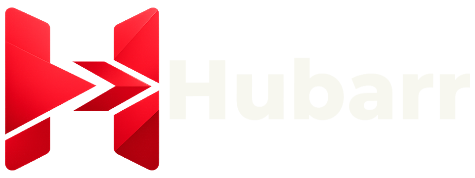
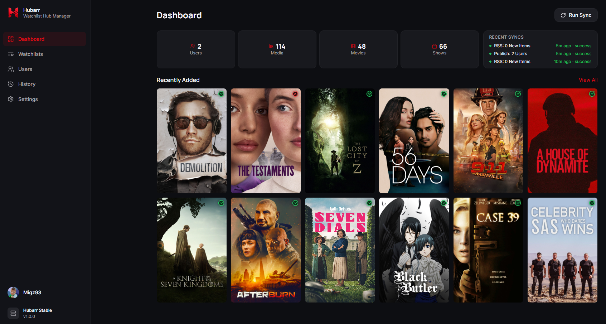

# Hubarr



[![GitHub Activity][commits-shield]][commits]
[![License][license-shield]][license]
[![Project Maintainer][maintainer-shield]][user_profile]
[![Buy me a coffee][buymecoffeebadge]][buymecoffee]

Hubarr is a self-hosted Plex companion that turns watchlists into managed Plex collections and hub rows.

It keeps your own Plex watchlist and selected friends' watchlists in sync with Plex, matches items against what is already in your libraries, and keeps per-user collections updated automatically through a simple web UI.

## What Hubarr Does

- Tracks your and/or your friends watchlists
- Matches watchlist items against content already available in Plex
- Keeps per-user movie and TV collections synced automatically
- Publishes those collections into Plex as hub rows
- Applies per-user label exclusions so each friend only sees their own watchlist

## Preview



## Key Features

- Plex-only sign-in with no local passwords
- Tracks your and/or your friends watchlists
- Fast watchlist updates using Plex RSS, with a scheduled GraphQL sync as a safety net
- Separate per-user movie and TV collections with shared naming
- Configurable publishing to Library Recommended, Home, and Friends Home
- Per-user collection naming, visibility, and target library controls

## How It Works

Hubarr uses a few background jobs:

- **Watchlist RSS Sync** watches Plex RSS feeds for quick watchlist changes and stores new items fast
- **Watchlist GraphQL Sync** regularly performs a fuller watchlist reconciliation to catch anything RSS missed
- **Plex Library Scans** help Hubarr notice when something from a watchlist has now actually appeared in your Plex libraries
- **Collection Sync** is the job that updates the Plex collections and hub rows

Together, that means Hubarr can react quickly when watchlists change, while still having a slower safety net that keeps everything accurate over time.

## Quick Start

### Requirements

- A Plex Media Server you manage
- At least one movie library and one TV library in Plex
- A Plex account
- Plex Pass is strongly recommended if you want fast RSS-based watchlist updates

### Docker

```bash
docker run -d \
  --name hubarr \
  --network bridge \
  -p 9301:9301 \
  -v /opt/hubarr:/config \
  --restart unless-stopped \
  ghcr.io/migz93/hubarr:latest
```

You can then open `http://localhost:9301` and complete setup in the browser.

### Docker Compose

```yaml
services:
  hubarr:
    image: ghcr.io/migz93/hubarr:latest
    container_name: hubarr
    network_mode: bridge
    restart: unless-stopped
    ports:
      - "9301:9301"
    volumes:
      - /opt/hubarr:/config
```

```bash
docker compose up -d
```

### Configuration

Hubarr is configured through its web UI after first run. The two things you may want to adjust in your Docker setup before starting:

- **Port** — change the left side of `9301:9301` to expose Hubarr on a different host port (e.g. `8080:9301`)
- **Data directory** — change the left side of `/opt/hubarr:/config` to store Hubarr's database and logs wherever you prefer on your host

### First Setup

1. Log in with Plex
2. Select the Plex server you want Hubarr to manage, then set the target movie and TV libraries
3. Discover friends from the Users page
4. Enable the users you want to track
5. Run a sync, or wait for the scheduled jobs to start working

## Important Limitations

### Plex Home Managed Users

Plex Home managed users (sub-accounts with no independent Plex account) have two limitations:

- **Watchlists cannot be synced.** Managed users have no presence in the Plex community API, so Hubarr cannot read their watchlist. They will appear in the Users page as read-only and cannot be enabled.
- **Label exclusions are applied automatically.** Even though their watchlist can't be synced, Hubarr will still apply label exclusion filters to managed users so that other users' watchlist collections don't appear for them. This happens as part of the normal collection sync.
- **Restriction Profiles block label exclusions.** If a managed user has a Plex restriction profile set (e.g. Younger Kid, Older Kid, Teen), Plex prevents label-based filter changes for that account. Hubarr skips those users entirely — the restriction profile itself is usually sufficient exclusion anyway.

### Plex Friends Home Privacy Caveat

Plex currently does not properly respect label-based restrictions for collections shown on Home and Recommended pages.

Because of that, publishing friends' watchlists to **Friends Home** is not currently recommended. If you enable it, friends may be able to see each other's watchlist collections on the Plex home screen.

More information:
- https://forums.plex.tv/t/privacy-issue-label-restrictions-not-respected-for-collections-on-the-home-recommended-pages/933544/9

## AI Transparency

Hubarr was created with heavy AI assistance.

Claude, Codex, and OpenAI Sora were all used throughout the project for design exploration, implementation help, refactoring, explanation, and iteration. The intent is not to hide that. Hubarr has been built by combining hands-on product direction with a lot of AI-assisted development work.

## Credits And Inspiration

Hubarr was shaped in part by studying projects that solve adjacent problems well, especially Seerr, Agregarr, and Pulsarr.

Those projects were helpful references for thinking about user experience, background job design, Plex integration patterns, logging ideas, and operational workflows. Hubarr is its own app with its own scope, but it would be unfair not to acknowledge the influence those projects had while this one was being built.

<table>
  <tr>
    <td align="center">
      <a href="https://github.com/seerr-team/seerr">Seerr</a>
    </td>
    <td align="center">
      <a href="https://github.com/agregarr/agregarr">Agregarr</a>
    </td>
    <td align="center">
      <a href="https://github.com/jamcalli/pulsarr">Pulsarr</a>
    </td>
  </tr>
  <tr>
    <td align="center">
      <a href="https://github.com/seerr-team/seerr">
        
      </a>
    </td>
    <td align="center">
      <a href="https://github.com/agregarr/agregarr">
        
      </a>
    </td>
    <td align="center">
      <a href="https://github.com/jamcalli/pulsarr">
        
      </a>
    </td>
  </tr>
</table>

[buymecoffee]: https://www.buymeacoffee.com/Migz93
[buymecoffeebadge]: https://img.shields.io/badge/buy%20me%20a%20coffee-donate-yellow.svg?style=for-the-badge
[commits-shield]: https://img.shields.io/github/commit-activity/y/Migz93/hubarr.svg?style=for-the-badge
[commits]: https://github.com/Migz93/hubarr/commits/main
[license]: https://github.com/Migz93/hubarr/blob/main/LICENSE
[license-shield]: https://img.shields.io/github/license/Migz93/hubarr.svg?style=for-the-badge
[maintainer-shield]: https://img.shields.io/badge/maintainer-Migz93-blue.svg?style=for-the-badge
[user_profile]: https://github.com/Migz93
